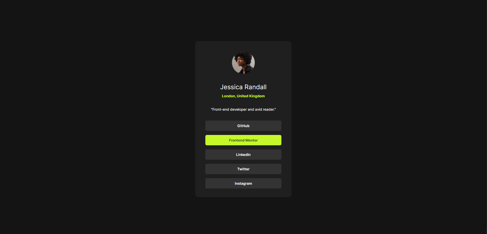

# Frontend Mentor - Social links profile solution

This is a solution to the [Social links profile challenge on Frontend Mentor](https://www.frontendmentor.io/challenges/social-links-profile-UG32l9m6dQ). Frontend Mentor challenges help you improve your coding skills by building realistic projects.

## Table of contents

- [Overview](#overview)
  - [The challenge](#the-challenge)
  - [Screenshot](#screenshot)
  - [Links](#links)
- [My process](#my-process)
  - [Built with](#built-with)
  - [What I learned](#what-i-learned)
- [Author](#author)

## Overview

Builing a social links page using the provided design file, for desktop and mobile view

### The challenge

Users should be able to:

- See hover and focus states for all interactive elements on the page

### Screenshot

### Links

[Solution URL](https://github.com/Antonvasilache/social-links-page)
[Live Site URL](https://av-blog-preview-card.netlify.app/)

## My process

1. Writing down the html structure top-down and placing the content inside.
2. Adding flex containers and centering content.
3. Resizing content to approximate the design file.
4. Margins, padding, border radius.
5. Fonts and colors.
6. Adjusting values for padding and margins to match the design layout.

### Built with

- Semantic HTML5 markup
- CSS custom properties
- Flexbox

### What I learned

- Using variables for various properties
- Working with margins

## Author

- Website - [Antonvasilache.com](https://www.antonvasilache.com)
- Frontend Mentor - [@Antonvasilache](https://www.frontendmentor.io/profile/Antonvasilache)
